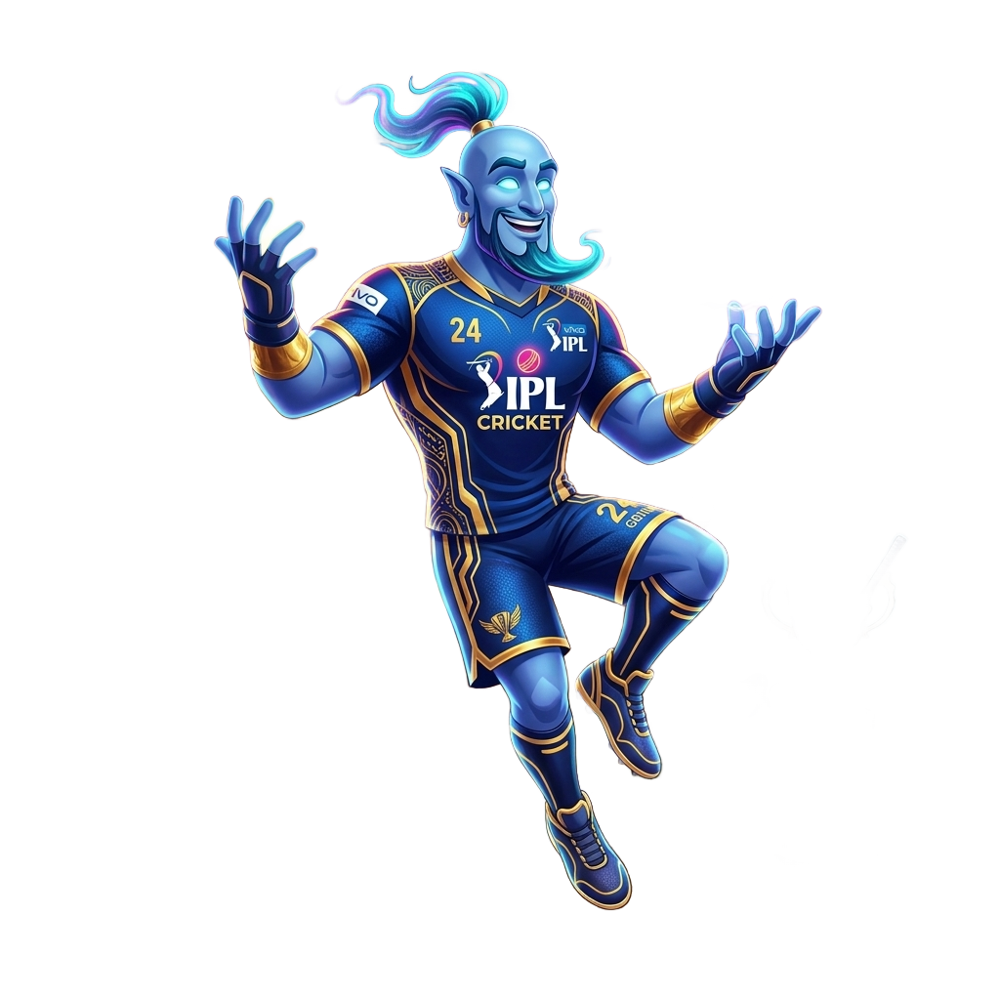
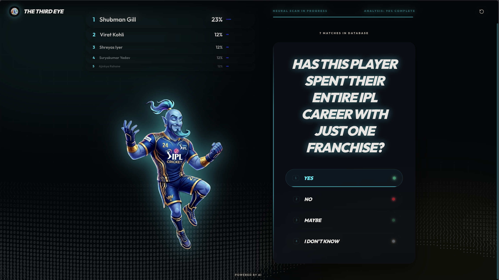
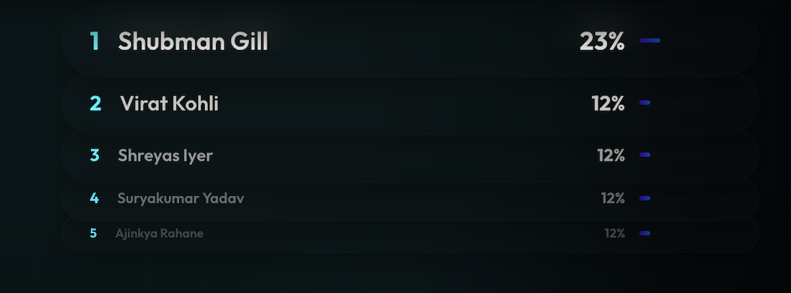
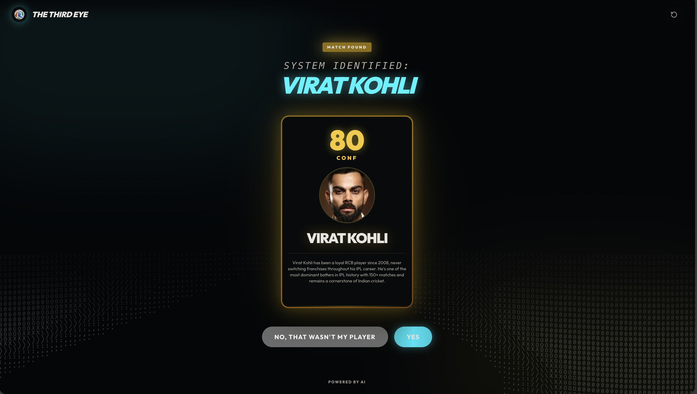

<div align="center">



# 🏏 IPL Akinator — The Third Eye

**An AI-powered Akinator that reads your mind and names any IPL player — in under 8 questions.**

[](https://python.org)
[](https://fastapi.tiangolo.com)
[](https://react.dev)
[](https://typescriptlang.org)
[](https://anthropic.com)

</div>

---

## What is this?

Think of a player. Any player who has ever stepped onto an IPL ground — from 2008 originals to modern-day stars. The Third Eye will identify them through a short sequence of yes/no questions, each one intelligently chosen to cut the search space in half.

Under the hood, it runs **Bayesian inference** over a database of **462 IPL players**, uses **information entropy** to pick the most discriminating question next, and calls **Claude Haiku** to phrase those questions as natural, cricket-fan-friendly language. If it guesses wrong, it doesn't give up — it eliminates the wrong candidate and keeps going.

---

## Demo

<div align="center">

| Questioning | Live Rankings | Player Reveal |
|:-----------:|:-------------:|:-------------:|
| |  |  |

</div>

---

## How It Works

### The Core Loop

```
Start → Uniform prior over 462 players
         ↓
         Pick highest-entropy attribute (Bayes Engine)
         ↓
         LLM phrases it as a natural question (Claude Haiku)
         ↓
         User answers: Yes / No / Maybe / Don't Know
         ↓
         Update posteriors via Bayes' Theorem
         ↓
         Confidence ≥ 80%  →  Make final guess
         ↓
         User says "Wrong"  →  Eliminate + continue (feedback loop)
```

### Bayesian Inference Engine

Each answer updates every player's probability using Bayes' Theorem:

```
P(player | answer) ∝ P(answer | player) × P(player)
```

- **"Yes"** — full weight update; players that don't match the attribute are penalized by a factor of `0.05`
- **"No"** — inverted full update
- **"Maybe"** — soft `0.5` weight update (partial evidence)
- **"Don't Know"** — skipped; no information, no change

The engine scores every candidate attribute by its **Shannon entropy** across the remaining player pool:

```
H(X) = -Σ p(x) · log₂ p(x)
```

Attributes with zero entropy (all remaining players share the same value) are filtered out as useless. The highest-scoring attribute is passed to the LLM to phrase into a question.

### LLM Question Generation (Claude Haiku)

Rather than showing raw attribute names like `is_wicketkeeper = True`, the engine passes the top-ranked attribute and a sample of real player values to Claude Haiku, which returns a natural question a cricket fan would actually ask — e.g. *"Is this player a wicket-keeper?"* or *"Did this player debut before 2013?"*.

For large candidate pools (>20 players), the LLM is force-constrained to use the highest-entropy attribute, preventing it from freelancing on weaker questions.

### Feedback Loop & Game Resumption

When the system makes a guess and the user says "that's wrong":

1. The guessed player is **eliminated** from the probability distribution
2. Probabilities are **renormalized** over the remaining candidates
3. If enough candidates remain → the game **resumes** with a new question
4. If 1–2 candidates remain → another guess is made immediately
5. If the pool is exhausted → the system concedes

This means the game never just ends on a wrong answer — it keeps fighting.

### Mascot Expression System

The mascot's face changes dynamically based on game state:

| Condition | Mascot State |
|---|---|
| Questions 1–5 (cold start) | Default / neutral |
| Top confidence < 60% | Unsure |
| Same answer twice in a row | Puzzled |
| Recovering from low confidence | Confident |
| Confidence > 60% near guess | Sure |
| No match found | Surprised |

---

## Features

- **462 IPL players** profiled across 30+ attributes: batting style, era, role, nationality, franchise history, match buckets, title wins, and more
- **Entropy-ranked question selection** — every question is mathematically chosen to halve the search space
- **LLM-phrased questions** via Claude Haiku — natural cricket language, not raw field names
- **Live animated top-5 leaderboard** — watch candidates rise and fall in real time as you answer
- **Animated mascot with dynamic expressions** — reacts to confidence and game state
- **Flip-reveal player card** — cinematic reveal on final guess with confidence score and reasoning
- **Live confidence bar** — visual indicator of how certain the engine is
- **Feedback loop** — wrong guess? The game continues, not restarts
- **4 answer modes** — Yes, No, Maybe, Don't Know (soft/zero Bayesian updates)
- **Framer Motion animations** throughout — page transitions, card reveals, floating mascot

---

## Tech Stack

| Layer | Technology |
|---|---|
| **Frontend** | React 19, TypeScript 6, Vite 8 |
| **Animations** | Framer Motion 12 |
| **Backend** | FastAPI, Python 3.13 |
| **Package Manager** | `uv` (Python), `npm` (Node) |
| **AI / LLM** | Anthropic Claude Haiku (`claude-haiku-4-5`) |
| **Inference** | Custom Bayesian engine (no ML framework) |
| **Player Data** | Hand-curated JSON — 462 players, 30+ attributes |

---

## Project Structure

```
ipl-akinator/
├── backend/
│   ├── bayes_engine.py          # Bayesian inference + entropy scoring
│   ├── game.py                  # Session management, game loop, feedback
│   ├── llm_engine.py            # Claude Haiku integration, question generation
│   └── ipl_player_profiles.json # 462-player database (30+ attributes each)
│
└── frontend/
    ├── src/
    │   ├── App.tsx               # Root — landing, question, result screens
    │   ├── hooks/
    │   │   └── useAkinator.ts    # Game state, API calls, mascot logic
    │   ├── components/
    │   │   ├── QuestionCard.tsx  # Question UI + answer buttons + progress bar
    │   │   ├── PlayerCard.tsx    # Animated flip-reveal result card
    │   │   ├── Top5Rankings.tsx  # Live candidate leaderboard
    │   │   ├── MatrixRain.tsx    # Background animation
    │   │   └── AsciiSurf.tsx     # Ambient background effect
    │   └── styles/               # CSS tokens, animations, component styles
    └── public/
        └── akinator-*.png        # Mascot expression assets
```

---

## Getting Started

### Prerequisites

- Python 3.13+ with [`uv`](https://docs.astral.sh/uv/) installed
- Node.js 18+ with `npm`
- An [Anthropic API key](https://console.anthropic.com/)

### 1. Clone the repo

```bash
git clone https://github.com/your-username/ipl-akinator.git
cd ipl-akinator
```

### 2. Backend setup

```bash
cd backend

# Install dependencies with uv
uv sync

# Create your environment file
echo "ANTHROPIC_API_KEY=your_key_here" > .env

# Start the API server
uv run uvicorn app:app --reload --port 8000
```

The backend will be live at `http://localhost:8000`.

### 3. Frontend setup

```bash
cd frontend

# Install dependencies
npm install

# Start the dev server
npm run dev
```

Open `http://localhost:5173` and start guessing.

---

## API Reference

| Method | Endpoint | Description |
|---|---|---|
| `POST` | `/game/new` | Start a new session, returns first question |
| `POST` | `/game/answer` | Submit an answer (`yes`/`no`/`maybe`/`dont_know`) |
| `POST` | `/game/feedback` | Submit guess feedback (`was_correct: bool`) |
| `DELETE` | `/game/{session_id}` | Clean up a session |

All sessions are in-memory. Each session tracks its own Bayesian engine, question history, and candidate pool independently.

---

## Design Decisions

**Why Bayesian inference instead of a decision tree?**
A decision tree picks a fixed branching path. Bayes updates a full probability distribution over all 462 players simultaneously — every answer narrows every candidate, not just one branch. This handles "Maybe" and "Don't Know" naturally without special-casing.

**Why call an LLM for question phrasing?**
Attributes like `debut_era = "2008-2012"` or `is_likely_captain = True` are not questions a cricket fan thinks in. The LLM bridges the gap between structured data and natural conversation, making the experience feel like talking to someone who actually watches IPL — not querying a spreadsheet.

**Why not just use the LLM to pick questions too?**
For large pools (>20 candidates), LLMs tend to pick intuitively appealing but informationally weak questions. The entropy engine is forced first; the LLM only handles phrasing. For small pools, the LLM is given more latitude since the stakes are lower.

---

<div align="center">

Built with 🏏 and a lot of Bayes

</div>